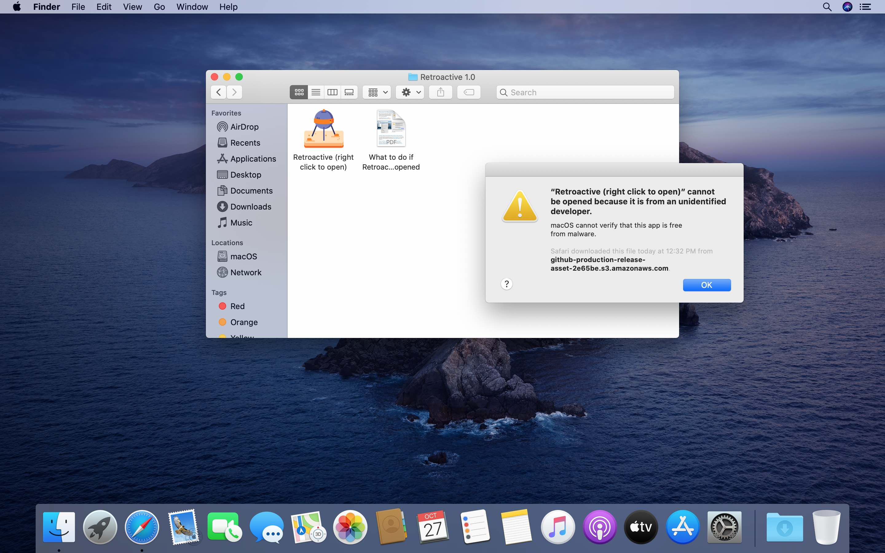
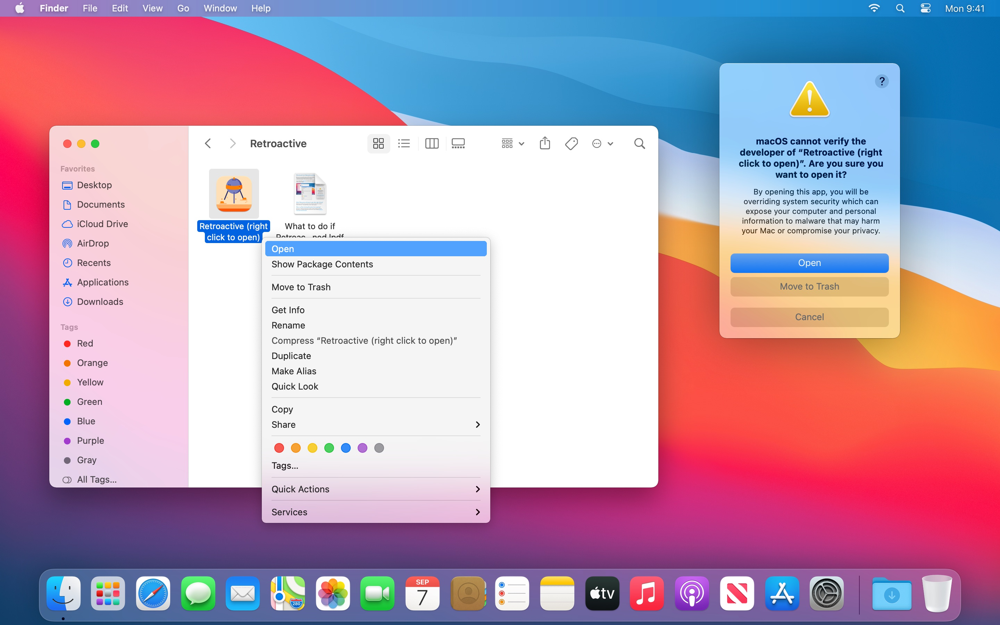
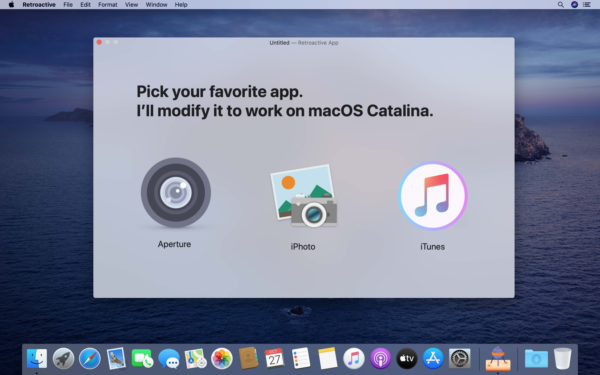
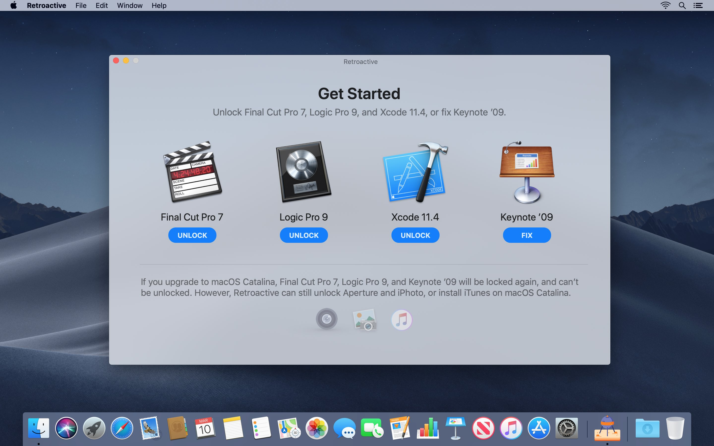
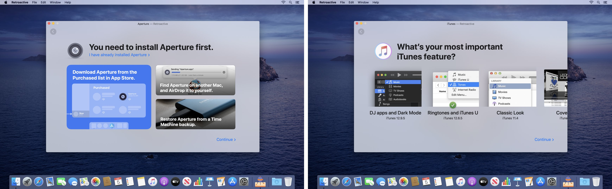
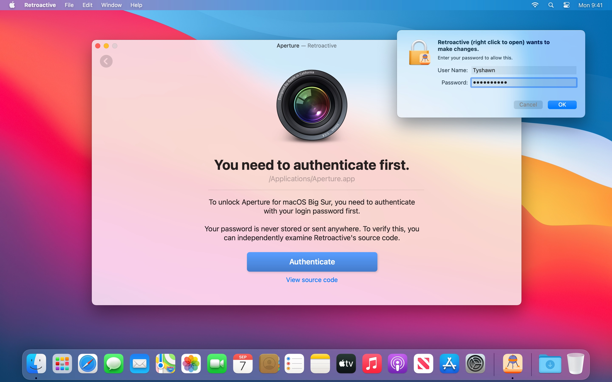
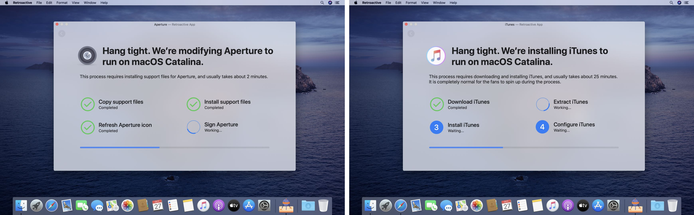
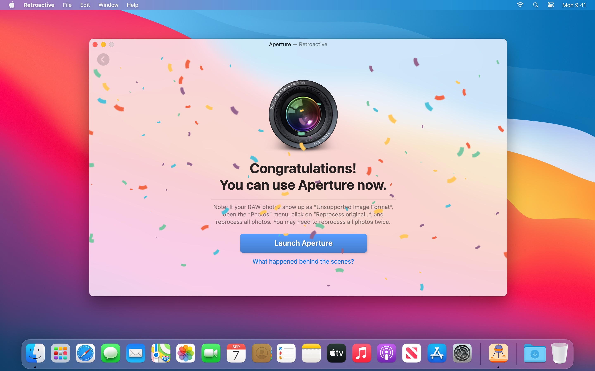
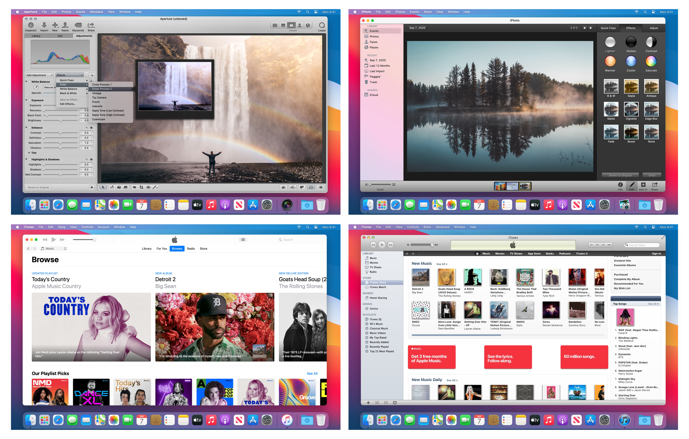
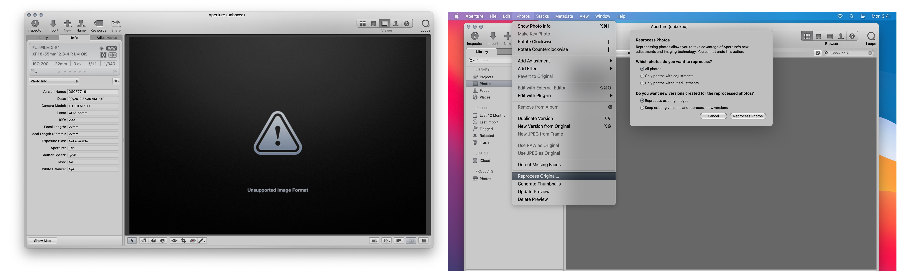

## Retroactive is an app that lets you run Aperture, iPhoto, and iTunes on macOS Catalina. It also lets you run Final Cut Pro 7, Logic Pro 9, and fix Keynote ’09 on macOS Mojave and macOS High Sierra. [Click to download the Retroactive app](https://github.com/cormiertyshawn895/Retroactive/releases/download/1.3/Retroactive.1.3.zip), or [view the release page](https://github.com/cormiertyshawn895/Retroactive/releases).

### Opening Retroactive

After downloading Retroactive, double click to open it. macOS may prompt you “Retroactive cannot be opened because it is from an unidentified developer.” This is completely normal and expected.

To open Retroactive, [right-click](https://support.apple.com/HT207700) on the Retroactive app in Finder, and click “Open” as shown below.

If you right-clicked when opening Retroactive for the first time, you need to [right-click](https://support.apple.com/HT207700) for a second time. If Retroactive still can’t be opened, [check your GateKeeper settings](https://support.apple.com/en-us/HT202491) under the General tab in System Preferences > Security & Privacy. Click “Open Anyway” to open Retroactive.

Retroactive will not harm your Mac. This alert only shows up because Retroactive is not notarized. Retroactive is open source, so you can always examine its source code to make sure it’s safe.

---

### Picking an app

Pick the app you want to run. If you want to run multiple apps from here, pick any one of them. You will always be able to get back to this screen later.

On macOS Mojave and macOS High Sierra, Retroactive can also unlock Final Cut Pro 7, Logic Pro 9 (experimental), and fix Keynote ’09.

I’ll use Aperture as the example, but the same process also works for iPhoto, iTunes, Final Cut Pro 7, Logic Pro 9, and Keynote ’09.

---

### Locating the app or choosing a version

Retroactive will automatically scan your Mac to locate an existing Aperture, iPhoto, iTunes, Final Cut Pro 7, Logic Pro 9, or Keynote ’09 install. If Retroactive has already located the app you would like to run, skip to the next section.

If Retroactive can’t locate an existing install of Aperture or iPhoto, you’ll either be asked to download it from the Purchased list in App Store, or re-install it from a DVD disc. You can also find the app on another Mac you own, then AirDrop it to this Mac, or restore the app from a Time Machine backup.

If you chose iTunes, Retroactive will ask you which version to install, then automatically download and install it for you.

- iTunes 12.9.5 supports Dark Mode and most DJ apps.
- iTunes 12.6.5 supports downloading and archiving iOS apps.
- iTunes 10.7 (not recommended) supports CoverFlow.

If you don’t know which version to install, keep the default setting and click “Continue”.

---

### Authenticating Retroactive

To install or modify the app you chose, you need to authenticate with your login password first. Click “Authenticate”, and enter your login password.

Your password is never stored or sent anywhere. To verify this, you can view Retroactive’s source code.

---

### Modifying the app

Retroactive will install or modify the app you chose. Modifying the app should only take about 2 minutes.

If you chose to install iTunes, this process takes longer. Depending on the version you chose, it can take between 10 minutes to an hour. It is completely normal for the fans to spin up during the process.

If Retroactive asks for your login password again, enter it again. Otherwise, the iTunes installation may be damaged or incomplete. If iTunes 12.9.5 can’t be installed, try to install iTunes 12.6.5.

---

### Using the app

After successfully modifying or installing the app, you can play with it to your heart's content.

- All Aperture features should be available except for playing videos, exporting slideshows, Photo Stream, and iCloud Photo Sharing. If RAW photos can't be opened, [you need to reprocess them](https://github.com/cormiertyshawn895/Retroactive#reprocessing-raw-photos-in-aperture).

- All iPhoto features should be available except for playing videos, exporting slideshows, Photo Stream, and iCloud Photo Sharing.

- All features should work for iTunes 12.9.5.

- All features should work for iTunes 12.6.5 except for backing up an iOS device. Use iTunes 12.9.5 or Finder to back up instead. Thumbnails of download apps may appear distorted.

- iTunes 10.7 may prompt “A required iTunes component is not installed. Please reinstall iTunes (-42401).” There is no need to reinstall iTunes.

- All Final Cut Pro 7 features should work.

- Support for Logic Pro 9 is experimental. You may see frequent freezes and hangs.

- After fixing Keynote ’09 with Retroactive, you can normally play slideshows.

---

### Reprocessing RAW photos in Aperture

- In Aperture, if your RAW photos show up as “*Unsupported Image Format*”, open the “*Photos*” menu, click on “*Reprocess original…*”, and reprocess all photos. After reprocessing your RAW photos, you will be able to preview and adjust them as before.

💡 Tip:

- If some RAW photos still show up as "*Unsupported Image Format*" after reprocessing, repeat the process above to reprocess all photos again. In other words, you may need to reprocess all photos twice. 

---

### Last words
- If GateKeeper prevents you from running modified versions of your chosen app, [temporarily disable GateKeeper in Terminal with `sudo spctl --master-disable`](http://osxdaily.com/2015/05/04/disable-gatekeeper-command-line-mac-osx/).

- To learn more about how Retroactive works, [take a technical deep dive](https://medium.com/@cormiertyshawn895/deep-dive-how-does-retroactive-work-95fe0e5ea49e).
