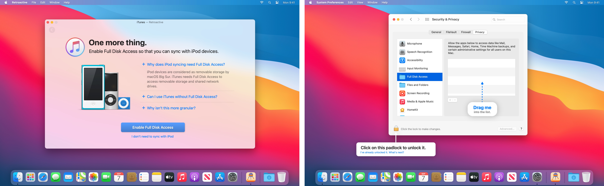

## Transition from Retroactive to supported apps

Retroactive has been discontinued, and does not support macOS Sequoia or later. You should transition from Retroactive to a wide range of supported apps, many of which are built into macOS or free to download.

#### iTunes

- Switch to [Music](https://support.apple.com/guide/music/welcome/mac), [TV](https://support.apple.com/guide/tvapp-mac/welcome/mac), [Podcasts](https://support.apple.com/guide/podcasts/welcome/mac), [Books](https://support.apple.com/guide/books/welcome/mac), and [Finder](https://support.apple.com/102471).
- Install Windows with [Parallels Desktop](https://www.parallels.com/products/desktop) or [VMware Fusion](https://www.vmware.com/products/fusion.html), then download [iTunes for Windows](https://apps.microsoft.com/detail/9PB2MZ1ZMB1S).
- To archive iPhone and iPad apps, use [IPATool](https://github.com/majd/ipatool), [iMazing](https://imazing.com), [Apple Configurator](https://apps.apple.com/app/id1037126344) [(tutorial)](https://raw.githubusercontent.com/cormiertyshawn895/Retroactive/master/Retroactive/Support/ConfiguratorTutorial.mp4), or [iTunes 12.6.5.3 for Windows](https://secure-appldnld.apple.com/itunes12/091-87819-20180912-69177170-B085-11E8-B6AB-C1D03409AD2A6/iTunes64Setup.exe).

#### Aperture and iPhoto
- Switch to [Photos](https://support.apple.com/guide/photos/welcome/mac), [Darktable](https://www.darktable.org), or [RawTherapee](https://www.rawtherapee.com).
- Purchase or subscribe to [AfterShot Pro](https://www.aftershotpro.com), [Capture One Pro](https://www.captureone.com), [Darkroom](https://apps.apple.com/app/id953286746), [DxO PhotoLab](https://www.dxo.com/dxo-photolab), [Lightroom](https://apps.apple.com/app/id1451544217), [Lightroom Classic](https://www.adobe.com/products/photoshop-lightroom-classic.html), [Luminar Neo](https://apps.apple.com/app/id1584373150), or [Photomator](https://apps.apple.com/app/id1444636541).

#### Final Cut Pro 7
- Export your projects into XML on a compatible Mac. Then import them into [DaVinci Resolve](https://apps.apple.com/app/id571213070), [Media Composer](https://www.avid.com/media-composer), or [Premiere Pro](https://www.adobe.com/products/premiere.html). You can also use [SendToX](https://apps.apple.com/app/id496926258) to import them into the latest version of [Final Cut Pro](https://apps.apple.com/app/id424389933).

---

## Retroactive

While Retroactive does not support macOS Sequoia or later, you can still use Retroactive to run Aperture, iPhoto, and iTunes on macOS Sonoma, macOS Ventura, macOS Monterey, macOS Big Sur, and macOS Catalina. Xcode 11.7 on macOS Mojave. Final Cut Pro 7, Logic Pro 9, and iWork ’09 on macOS Mojave or macOS High Sierra.

  

---

### Opening Retroactive

After downloading Retroactive, double click to open it. macOS may prompt you “Retroactive cannot be opened because it is from an unidentified developer.” This is expected.

To open Retroactive, navigate to System Settings > Privacy & Security, then scroll down and click [“Open Anyway”](https://support.apple.com/102445#openanyway).

Retroactive will not harm your Mac. This alert only shows up because Retroactive is not notarized. Retroactive is open source, so you can always examine its source code to make sure it’s safe.

---

### Picking an app

Retroactive has been discontinued, and does not support macOS Sequoia or later.

On macOS Sonoma, macOS Ventura, macOS Monterey, macOS Big Sur, and macOS Catalina, Retroactive can unlock Aperture and iPhoto, or install iTunes. Pick the app you want to run. If you want to run multiple apps from here, pick any one of them. You will always be able to get back to this screen later.

On macOS Mojave and macOS High Sierra, Retroactive can also unlock Final Cut Pro 7, Logic Pro 9 (experimental), Xcode 11.7 (requires macOS Mojave), and fix iWork ’09.

I’ll use Aperture as the example, but the same process also works for iPhoto, iTunes, Final Cut Pro 7, Logic Pro 9, Xcode 11.7, and iWork ’09.

---

### Locating the app or choosing a version

Retroactive will automatically scan your Mac to locate an existing Aperture, iPhoto, Final Cut Pro 7, Logic Pro 9, Xcode 11.7, or iWork ’09 install. If Retroactive has already located the app you would like to run, skip to the next section.

If Retroactive can’t locate an existing install, you’ll either be asked to download it from the Purchased list in App Store, or re-install it from a DVD disc. You can also find the app on another Mac you own, then AirDrop it to this Mac, or restore the app from a Time Machine backup.

If you chose iTunes, Retroactive will ask you which version to install, then automatically download and install it for you.

- iTunes 12.9.5 supports Dark Mode and most DJ apps.
- iTunes 12.6.5 supports Ringtones and iTunes U.
- iTunes 11.4 has a classic look.
- iTunes 10.7 supports CoverFlow.

If you don’t know which version to install, keep the default setting and click “Continue”.

---

### Authenticating Retroactive

To install or modify the app you chose, you need to authenticate with your login password first. Click “Authenticate”, and enter your login password.

Your password is never stored or sent anywhere. To verify this, you can view Retroactive’s source code.

---

### Modifying the app

Retroactive will install or modify the app you chose. Modifying the app should only take about 2 minutes.

If you chose to install iTunes, this process may longer. 

- Depending on the version you chose, it can take between 10 minutes to an hour.
- It is completely normal for the fans to spin up during the process.
- If Retroactive asks for your login password again, re-enter it again.
- If iTunes 12.9.5 can’t be installed, try to install iTunes 12.6.5.

After installing iTunes, Retroactive will ask you about iPod syncing. If you need to sync with iPod devices, click "Enable Full Disk Access", and follow on-screen instructions provided by Retroactive.

That's it! You can use the app now.

---

### Using the app

After successfully modifying or installing the app, you can play with it to your heart's content.

- All Aperture features should be available except for playing videos, exporting slideshows, Photo Stream, and iCloud Photo Sharing. If RAW photos can't be opened, [you need to reprocess them](https://github.com/cormiertyshawn895/Retroactive#reprocessing-raw-photos-in-aperture).

- All iPhoto features should be available except for playing videos, exporting slideshows, Photo Stream, and iCloud Photo Sharing.

- All features should work for iTunes 12.9.5.

- Most features should work for iTunes 12.6.5. Use iTunes 12.9.5 or Finder to back up your device instead. Use [Apple Configurator 2](https://apps.apple.com/app/apple-configurator-2/id1037126344) to [download iOS apps on your Mac](https://www.youtube.com/watch?v=M_3t06FEhR0).

- Movies and TV Shows downloaded from the iTunes Store may be unable to play in iTunes. Download or play them in the TV app instead. 

- Some dialogs in iTunes may display a crossed-out iTunes icon. This is purely cosmetic and has no functional impact.

- All Final Cut Pro 7 features should work.

- Support for Logic Pro 9 is experimental. You may see frequent freezes and hangs.

- Most Xcode 11.7 features should work.

- After fixing iWork ’09, text format and paragraph alignment controls in the format bar should appear correctly. Scroll bars will no longer appear behind the document canvas.

- After fixing Keynote ’09 with Retroactive, you can normally play slideshows.

- After fixing Pages ’09 with Retroactive, typing and scrolling in Pages ’09 should be more responsive.

---

### Syncing with a device

If you connect an Apple device to your Mac, and either see nothing in iTunes, or "The device is in use by another user on this computer":

- Disconnect the device from your Mac, but keep iTunes open.
- Click on the Spotlight icon (magnifying glass) on the menu bar.
- Type "Terminal" and press return to open the Terminal app.
- Enter `killall AMPDevicesAgent` in the Terminal window, and press return.
- Connect the Apple device back to your Mac.

If you connect an Apple device to your Mac, and see "iTunes cannot read the contents of the device. Go to the Summary tab in device preferences and click Restore to restore this device to factory settings":

- You may have installed iTunes with Retroactive 1.4 or earlier.
- Once you reinstall iTunes [using the latest version of Retroactive](https://github.com/cormiertyshawn895/Retroactive/releases/), iTunes should be able to read the contents of your device as expected.
- At the end of the installation process, Retroactive will ask you about iPod syncing. If you need to sync with iPod devices, click "Enable Full Disk Access".

If you try to enable VoiceOver for iPod shuffle, but see "iTunes was unable to install the VoiceOver Kit. An unknown error occurred (1701)":

- [Directly download the VoiceOver 1.4.2 installer here](https://swdist.apple.com/content/downloads/29/37/041-91732-A_LSWLP6NLRV/bk8l36k29x8d146doiwcvuv8qemu3mzxwk/VoiceOver.pkg).
- Install the downloaded VoiceOver.pkg.
- Quit and re-open iTunes.

---

### Downloading iOS Apps

Starting from April 2020, you'll need to use [Apple Configurator 2](https://apps.apple.com/app/apple-configurator-2/id1037126344) to [download iOS apps on your Mac](https://www.youtube.com/watch?v=M_3t06FEhR0).

---

### Final Cut Pro 7 and the Apple Pro Video Formats update

If you install Apple Pro Video Formats update from Software Update, you may need to [follow these instructions](https://github.com/cormiertyshawn895/Retroactive/issues/130#issuecomment-724078303) to re-enable Final Cut Pro 7.

---

### Reprocessing RAW photos in Aperture

- In Aperture, if your RAW photos show up as “*Unsupported Image Format*”, open the “*Photos*” menu, click on “*Reprocess original…*”, and reprocess all photos. After reprocessing your RAW photos, you will be able to preview and adjust them as before.

💡 Tip:

- If some RAW photos still show up as "*Unsupported Image Format*" after reprocessing, repeat the process above to reprocess all photos again. In other words, you may need to reprocess all photos twice. 

---

### Workaround to install Final Cut Pro 7 in VMware Fusion

If you don't have a Mac released before Late 2019, you can still install Final Cut Pro 7 in VMware Fusion to export existing Final Cut Pro 7 projects into XML files. This lets SendToX, DaVinci Resolve, Media Composer, and Premiere Pro open them. 

- [Install macOS Mojave virtual machine with VMware Fusion](https://www.huibdijkstra.nl/how-to-set-up-a-osx-mojave-vm-in-vmware-fusion/). Other virtual machine software, such as Parallels Desktop, is not supported and will not work.
- After mounting the Final Cut Studio installer in VMware Fusion, right click on Install Final Cut Studio.pkg > Show Original, then copy FinalCutStudio.mpkg and Packages to VMware Fusion's Desktop
- Right click on the copied FinalCutStudio.mpkg > Show Package Contents > Resources
- Right click on Requirements Checker.app > Show Package Contents > Contents > Resources
- Delete minsys.plist
- Double click on the modified FinalCutStudio.mpkg to start the install
- Use Retroactive as usual

To use editing features such as timeline and preview, install macOS Mojave on a real, older Mac released before Late 2019, then run Retroactive as usual.

---

### Last words
- If GateKeeper prevents you from running modified versions of your chosen app, [temporarily disable GateKeeper in Terminal](http://osxdaily.com/2015/05/04/disable-gatekeeper-command-line-mac-osx/) with `sudo spctl --master-disable`.

- To learn more about how Retroactive works, [take a technical deep dive](https://medium.com/@cormiertyshawn895/deep-dive-how-does-retroactive-work-95fe0e5ea49e).
